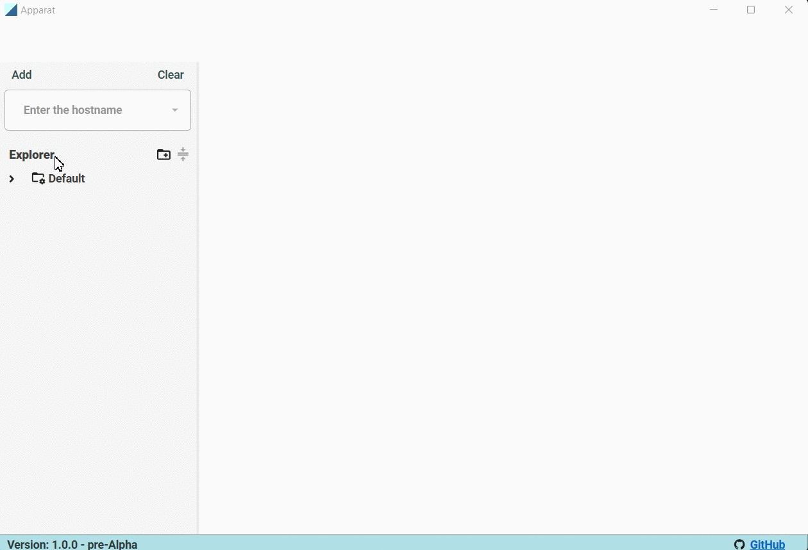

# Apparat

**Apparat** - open source software for short-term network connection monitoring.

_The idea of the program was inspired by working with [WinMTR](https://github.com/White-Tiger/WinMTR)._

Designed for **Windows OS** with **.NET 6 SDK** installed

## In action

### Warning!
_At the moment, early versions - the program may unexpectedly freeze and give errors._

### Development stack of the current version of the program :
* WPF/.NET 6 - [.NET 6 SDK](https://dotnet.microsoft.com/en-us/download/dotnet/6.0).
* [LiveCharts2](https://github.com/beto-rodriguez/LiveCharts2) - LiveChartsCore.SkiaSharpView.WPF v2.0.0-beta.361.
* [Material Design In XAML](https://github.com/MaterialDesignInXAML/MaterialDesignInXamlToolkit) - v4.5.0
* [NetObserver.Helper](https://github.com/hekkaaa/NetObserver) - v1.1.2
* [gong-wpf-dragdrop](https://github.com/punker76/gong-wpf-dragdrop) - v3.1.1

## Downloads
**[Download it now](https://github.com/hekkaaa/Apparat/releases/latest)**

## Feedback and bug reports

Telegram: https://t.me/Hekkaaa

Email: silencemyalise@gmail.com
